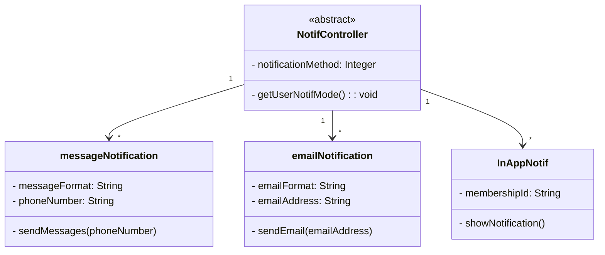

```Mermaid

sequenceDiagram
    activate TransactionEnquiryAPI
    TransactionEnquiryAPI -) TransactionEnquiryAPI:getTransactionDetails()
    deactivate TransactionEnquiryAPI
    TransactionEnquiryAPI -->> NotifController: TransactionStatus_Updated == True
    
    activate NotifController
    NotifController -) NotifController:getUserNotifMode()
    NotifController -) User: sendNotification()
    deactivate NotifController

```
