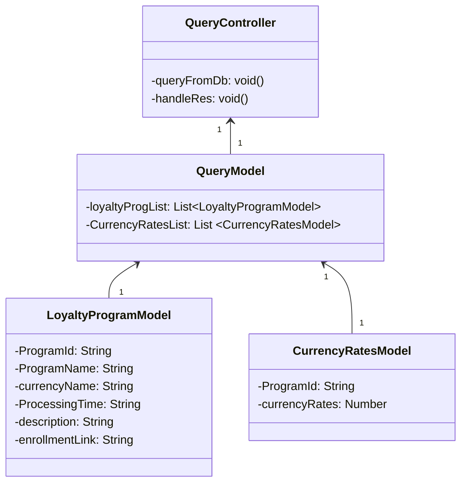

# TransferConnect

### Loyalty Program Query

```mermaid
classDiagram
QueryModel "1" <-- "1" LoyaltyProgramModel
QueryController"1" <-- "1"  QueryModel
QueryModel "1" <-- "1"  CurrencyRatesModel

class QueryModel{
    -loyaltyProgList: List<<LP>LoyaltyProgramModel>
    -CurrencyRatesList: List <<LP>CurrencyRatesModel>
}

class LoyaltyProgramModel{
    -ProgramId: String
    -ProgramName: String
    -currencyName: String
    -ProcessingTime: String
    -description: String 
    -enrollmentLink: String
}
 

class CurrencyRatesModel{
    -ProgramId: String
  -currencyRates: Number
}

class QueryController{
    -queryFromDb: void()   
    -handleRes: void()
}
```
