# Bank App

### Login 
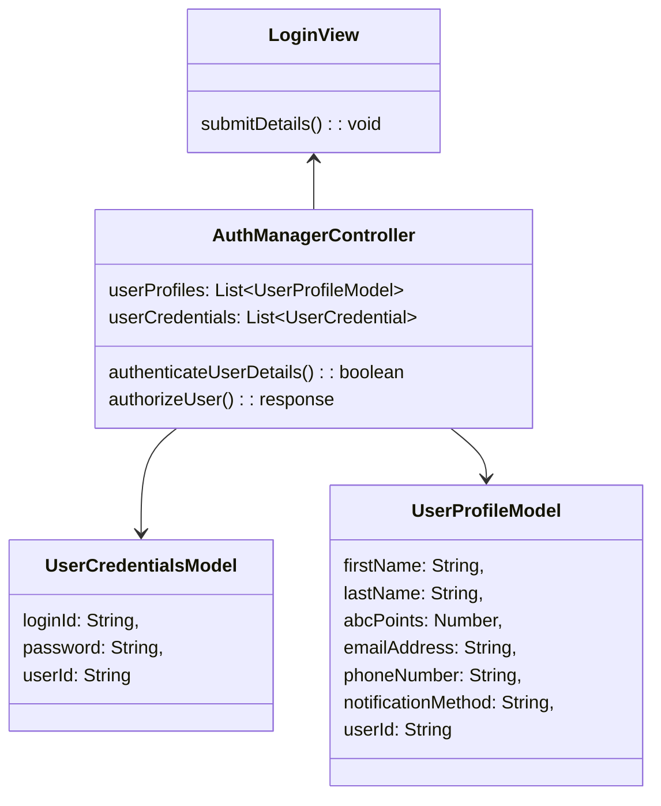
### Query Loyalty Program Details (Loyalty Points Marketplace)

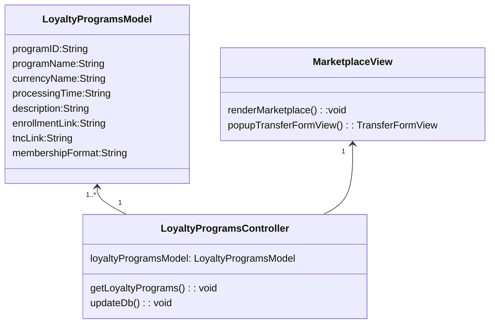

### Submit Credit Transfer Request
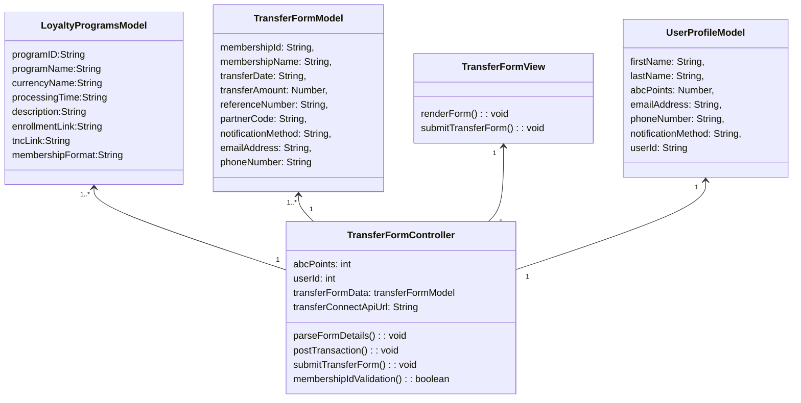

### Enquire Transaction Status

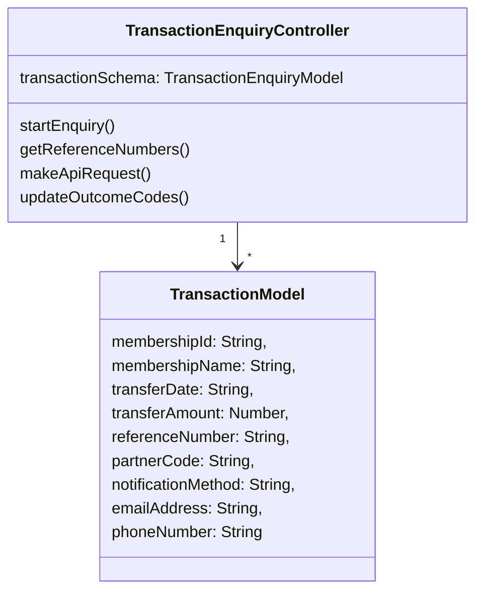
### Receive Webhook Post

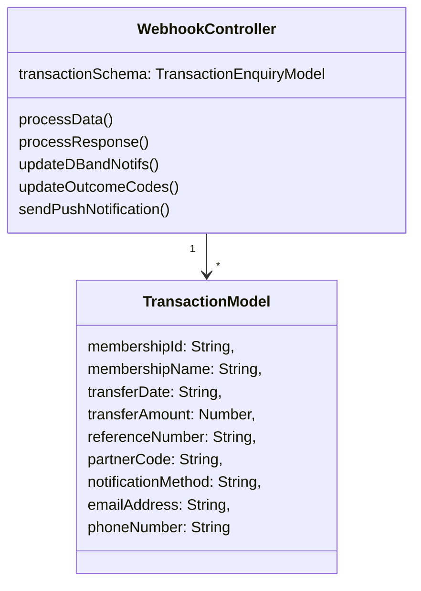

# TransferConnect

### Loyalty Program Query
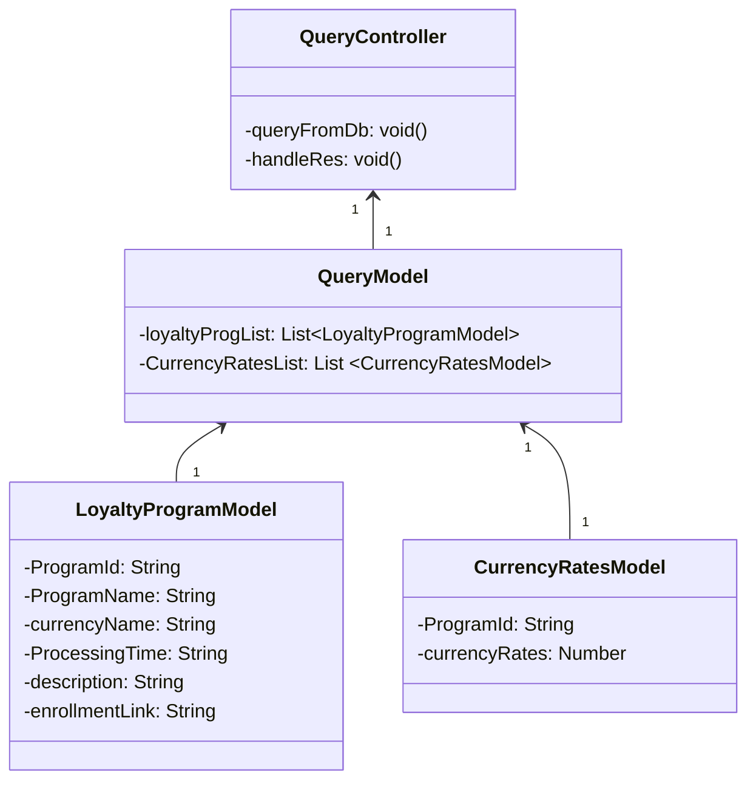

### Enquire Transaction Status

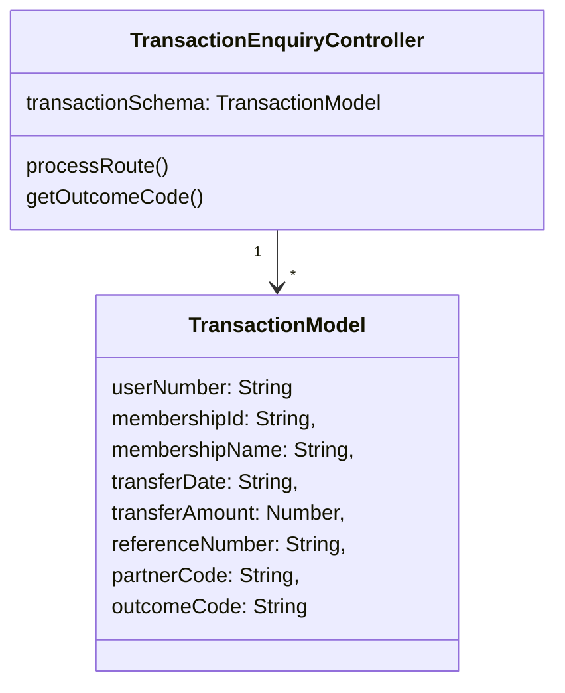

### Post Webhook 

### Notify Transaction Status

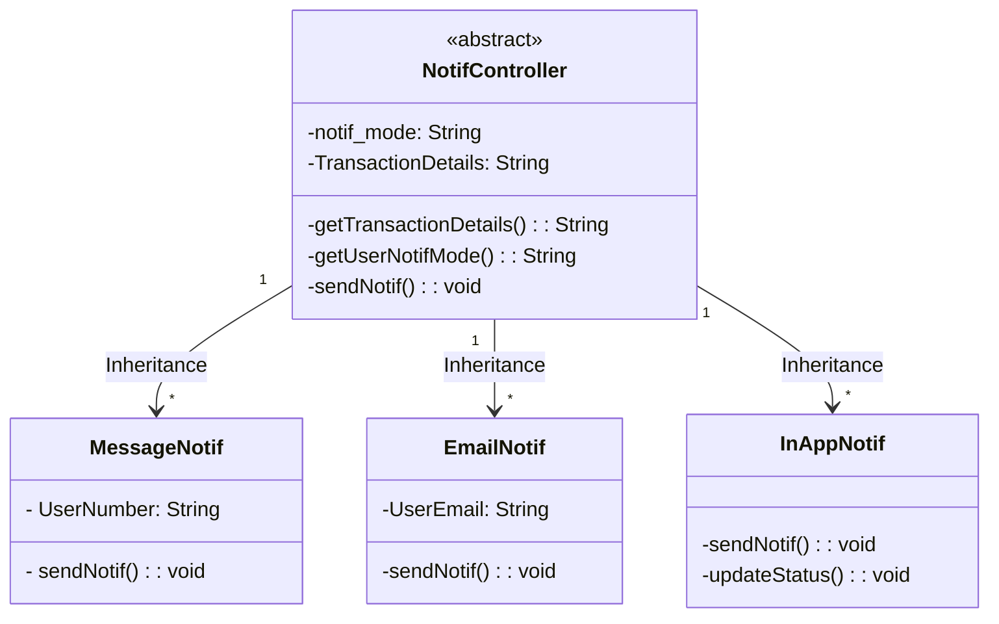
### Send Transfer Fulfilment Accrual Files 

### Receive Transfer Fulfilment Handback File 
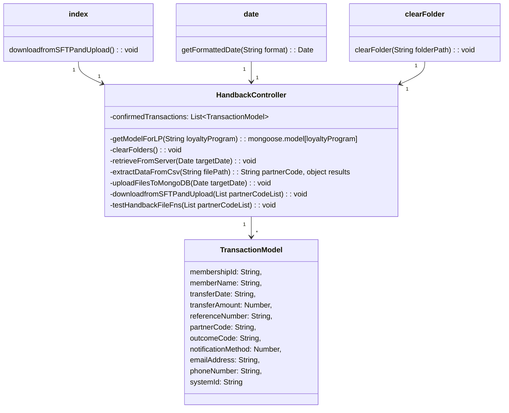

# Sequence Diagrams
### Transaction submission flow between BA client,BA server, BA database, TC server and TC database.
BA- Bank app.
TC - Transfer connect app

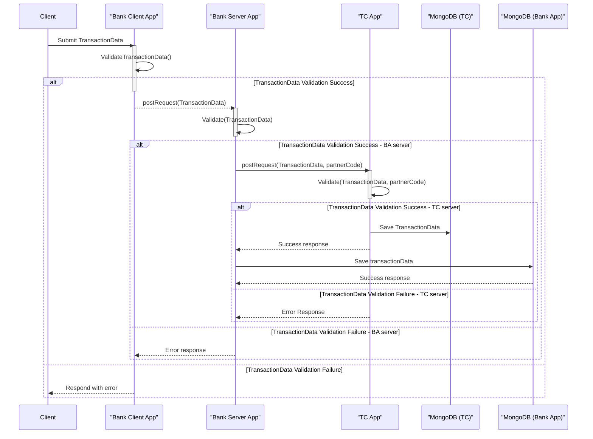
### Daily interactions between TransferConnect App and Bank App to supply information about Loyalty Programs
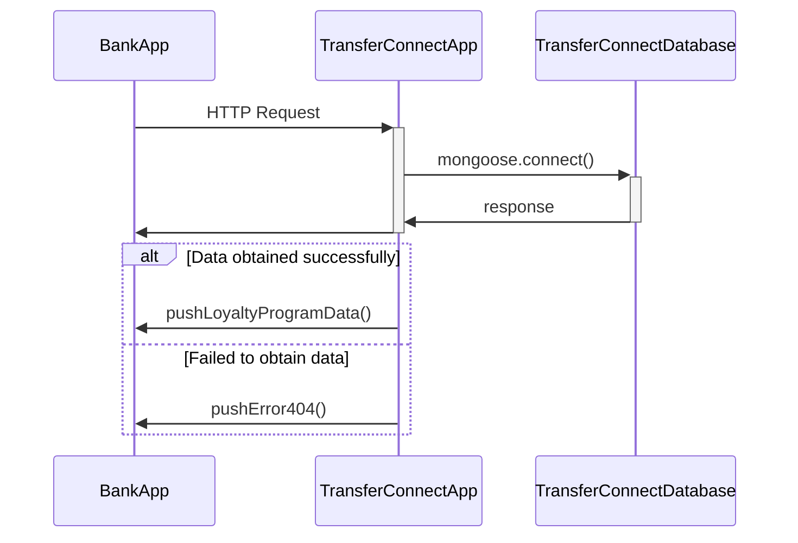

### Interactions between Bank App and TransferConnect App to support Bank App transaction enquiries

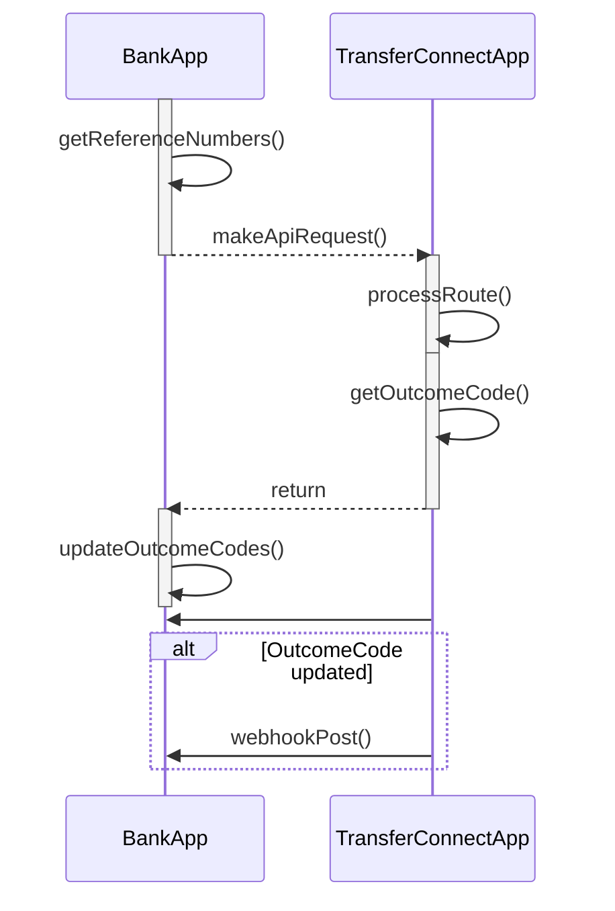

   

### Interactions between TransactionEnquiry API provided by TransferConnect App and Notif Controller in Bank App to support notifications to Bank App/Bank App User

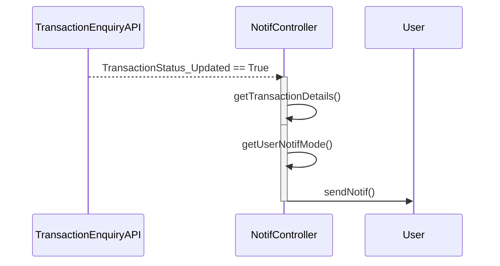

# Backend API
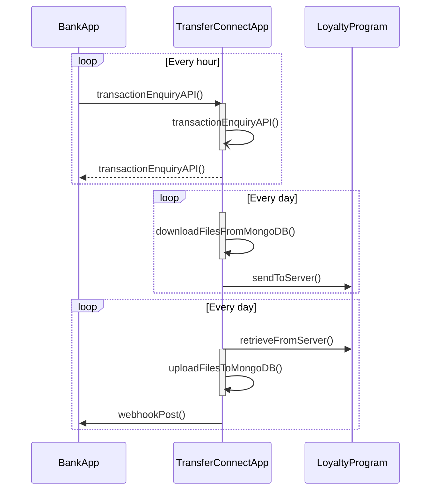

