# Bank App Class Diagrams

### Login (Server)
This component describes user authentication for logging in to the bank application, access API routes. This component also describes the encryption and decryption of crucial user credentials and their respective user profile details and services the frontend to provide protection and user authorization to various routes.

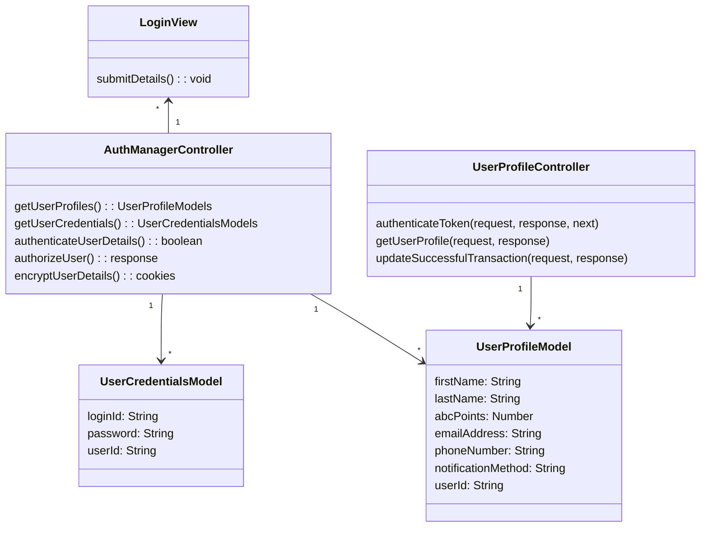
```mermaid
classDiagram
LoginView "*" <-- "1" AuthManagerController
AuthManagerController "1" --> "*" UserCredentialsModel 
AuthManagerController "1" --> "*" UserProfileModel 

class LoginView{
    submitDetails(): void
}

class UserCredentialsModel{
  loginId: String
  password: String
  userId: String
}

class UserProfileModel{
    firstName: String
    lastName: String
    abcPoints: Number
    emailAddress: String
    phoneNumber: String
    notificationMethod: String
    userId: String
}

class AuthManagerController{
    getUserProfiles(): UserProfileModels
    getUserCredentials(): UserCredentialsModels
    authenticateUserDetails(): boolean
    authorizeUser(): response
    encryptUserDetails(): cookies
}

class UserProfileController {
    authenticateToken(request, response, next)
    getUserProfile(request, response)
    updateSuccessfulTransaction(request, response)
  }
  

  UserProfileController "1" --> "*" UserProfileModel
```

# Bank App Class Diagrams

### Query Loyalty Program Details (Loyalty Points Marketplace)
This component queries Loyalty Program details from the TransferConnect API endpoint daily to get updated Loyalty Program details and updates the Loyalty Program details in the bank application database. This component also services the marketplace view to bank users, to show the available Loyalty Program partners, currency rates.

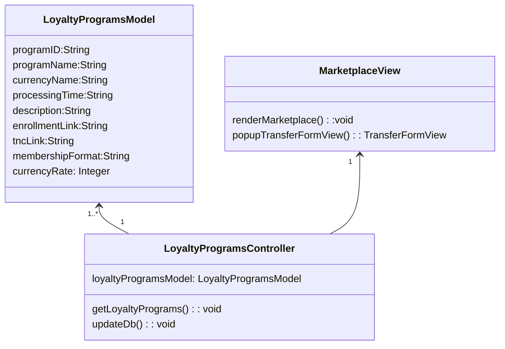
```mermaid
classDiagram

LoyaltyProgramsModel "1..*" <-- "1" LoyaltyProgramsController
MarketplaceView "1" <-- "1" LoyaltyProgramsController


class LoyaltyProgramsModel {
    programID:String 
    programName:String
    currencyName:String
    processingTime:String
    description:String
    enrollmentLink:String
    tncLink:String
    membershipFormat:String
    currencyRate: Integer
}


class LoyaltyProgramsController {
  loyaltyProgramsModel: LoyaltyProgramsModel
  getLoyaltyPrograms(): void
  updateDb(): void
}

class MarketplaceView {
  renderMarketplace():void
  popupTransferFormView(): TransferFormView
}

```

# Bank App Class Diagrams

### Submit Credit Transfer Request
This component facilitates credit transfers by validating user form inputs, and generating unique reference numbers for each transaction, lints transaction details and sends a post request to the TransferConnect API endpoint to submit transactions. This component also serves the bank application frontend, providing forms for various Loyalty Programs and their currency rates to allow users to submit inputs on the website.

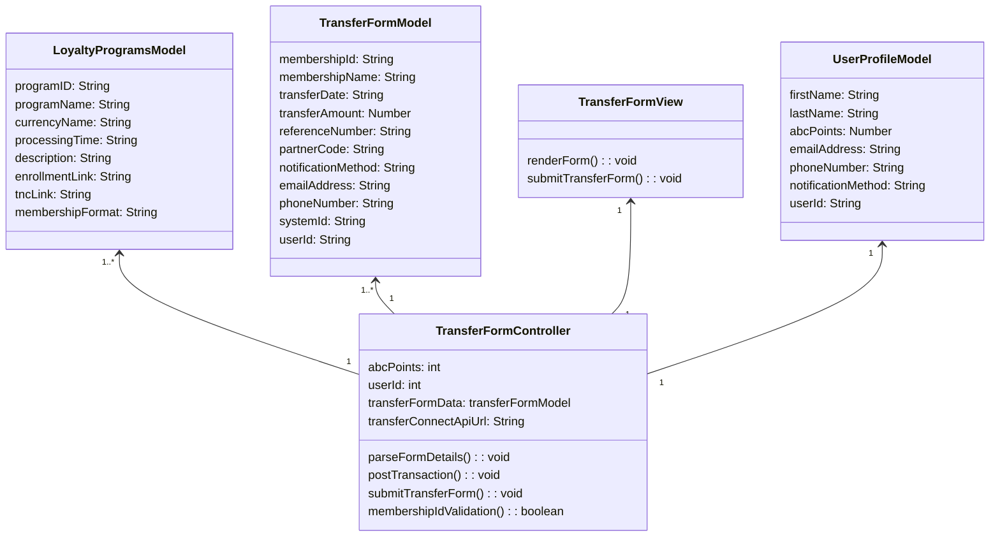
```mermaid
classDiagram

LoyaltyProgramsModel "1..*" <-- "1" TransferFormController
TransferFormModel "1..*" <-- "1" TransferFormController
TransferFormView "1" <-- "1" TransferFormController
UserProfileModel "1" <-- "1" TransferFormController

class LoyaltyProgramsModel {
    programID: String 
    programName: String
    currencyName: String
    processingTime: String
    description: String
    enrollmentLink: String
    tncLink: String
    membershipFormat: String
}

class TransferFormModel {
  membershipId: String
  membershipName: String
  transferDate: String
  transferAmount: Number
  referenceNumber: String
  partnerCode: String
  notificationMethod: String
  emailAddress: String
  phoneNumber: String
  systemId: String
  userId: String
}

class UserProfileModel{
    firstName: String
    lastName: String
    abcPoints: Number
    emailAddress: String
    phoneNumber: String
    notificationMethod: String
    userId: String
}

class TransferFormController {
  abcPoints: int
  userId: int
  transferFormData: transferFormModel
  transferConnectApiUrl: String

  parseFormDetails(): void  
  postTransaction(): void
  submitTransferForm(): void
  membershipIdValidation(): boolean
}

class TransferFormView {
  renderForm(): void
  submitTransferForm(): void
}


```

# Bank App Class Diagrams

### Enquire Transaction Status
This component in the bank application sends queries to the TransferConnect API endpoint to enquire about transaction status updates. It also processes the updated transactions and updates the bank application database if there are any updates. 

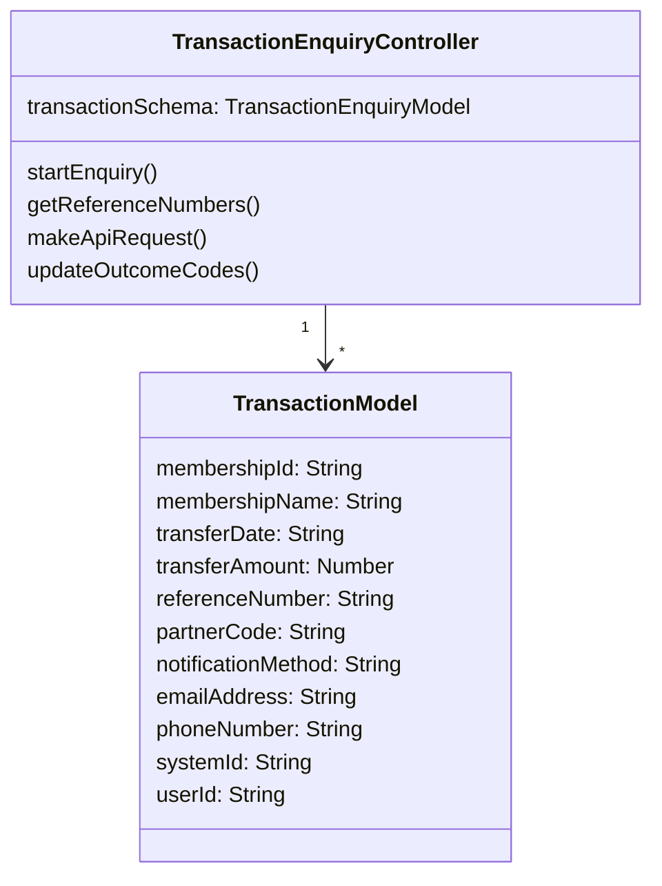
```mermaid
classDiagram
class TransactionEnquiryController 
TransactionEnquiryController "1" --> "*" TransactionModel


class TransactionEnquiryController{
    transactionSchema: TransactionEnquiryModel
    startEnquiry()
    getReferenceNumbers()
    makeApiRequest()
    updateOutcomeCodes()
}

class TransactionModel{
  membershipId: String
  membershipName: String
  transferDate: String
  transferAmount: Number
  referenceNumber: String
  partnerCode: String
  notificationMethod: String
  emailAddress: String
  phoneNumber: String
  systemId: String
  userId: String
}
```

# Bank App Class Diagrams

### Receive Transaction Status Update Webhook Post

This component describes the functionalities to support the Bank App in handling transaction status updates from TransferConnect via post. Upon receiving this request, this component also processes the response, updates the transaction details to the database. 

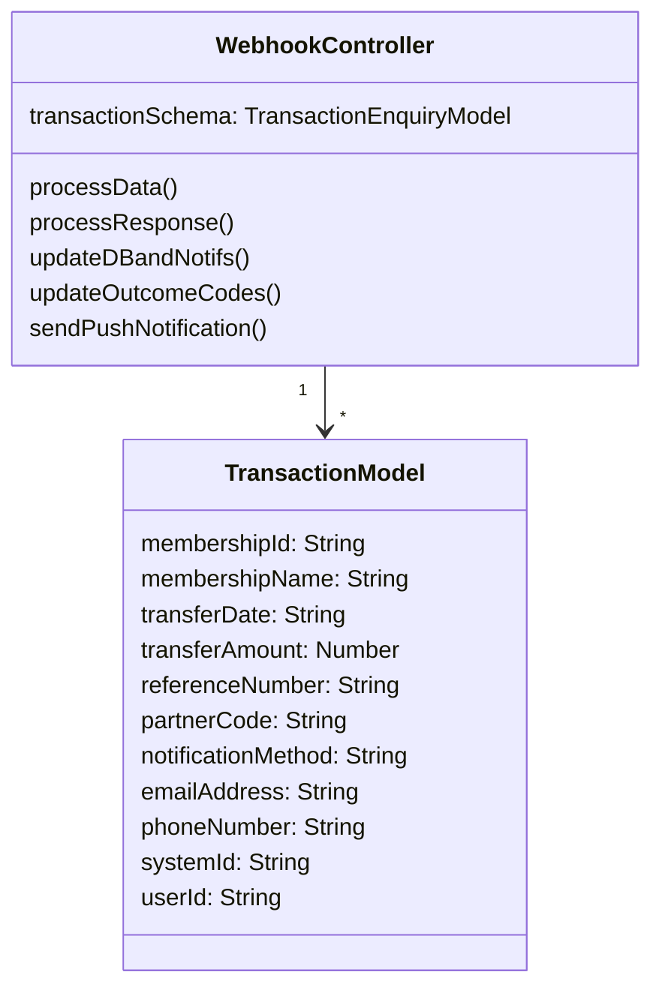
```mermaid
classDiagram
class WebhookController 
WebhookController "1" --> "*" TransactionModel


class WebhookController{
    transactionSchema: TransactionEnquiryModel
    processData()
    processResponse()
    updateDBandNotifs()
    updateOutcomeCodes()
    sendPushNotification()
}

class TransactionModel{
  membershipId: String
  membershipName: String
  transferDate: String
  transferAmount: Number
  referenceNumber: String
  partnerCode: String
  notificationMethod: String
  emailAddress: String
  phoneNumber: String
  systemId: String
  userId: String
}
```

# TransferConnect Class Diagrams

### Loyalty Program Query
This component handles Loyalty Program details queries from various bank applications to give the various bank applications updated Loyalty Program information daily. It also serves to compile mapped exchange rates from each Loyalty Programs to each bank and be the ground truth for exchange rates.

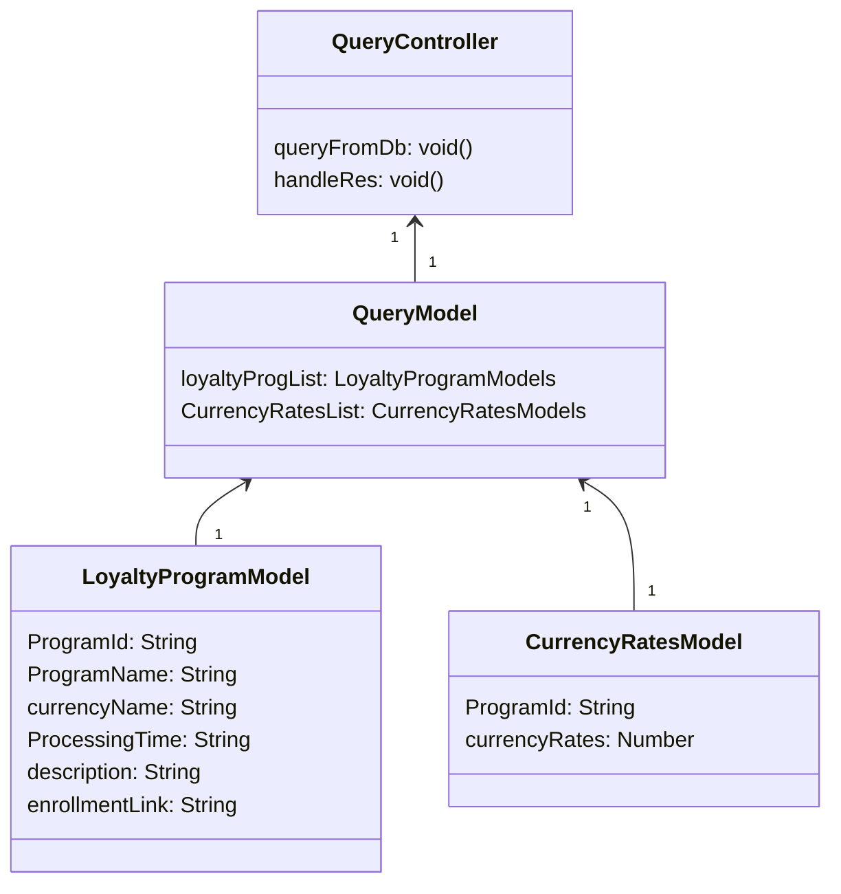
```mermaid
classDiagram

class QueryModel{
    loyaltyProgList: LoyaltyProgramModels
    CurrencyRatesList: CurrencyRatesModels
}

class LoyaltyProgramModel{
    ProgramId: String
    ProgramName: String
    currencyName: String
    ProcessingTime: String
    description: String 
    enrollmentLink: String
}
 

class CurrencyRatesModel{
   ProgramId: String
  currencyRates: Number
}

class QueryController{
    queryFromDb: void()   
    handleRes: void()
}
QueryController "1" <-- "1" QueryModel
QueryModel "1" <-- "1" LoyaltyProgramModel
QueryModel "1" <-- "1" CurrencyRatesModel

```

# TransferConnect Class Diagrams

### Enquire Transaction Status
This component handles transaction status queries from various bank applications to give banks updates about their transaction status.

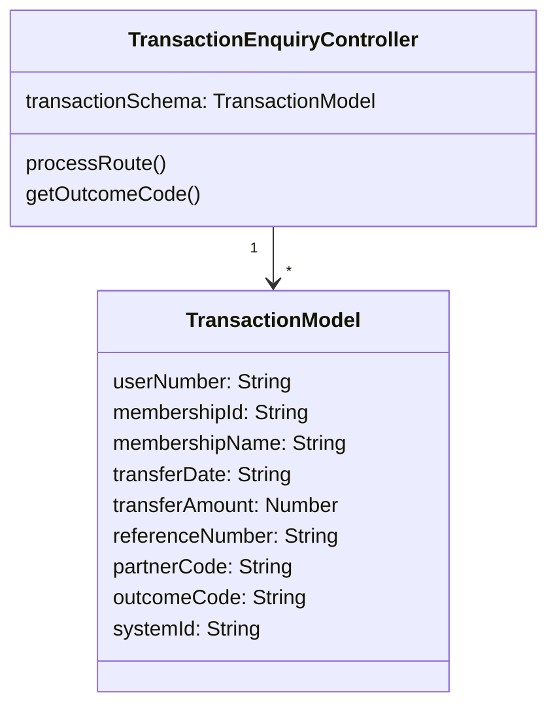
```mermaid
classDiagram
class TransactionEnquiryController
TransactionEnquiryController "1" --> "*" TransactionModel


class TransactionEnquiryController{
    transactionSchema: TransactionModel
    processRoute()
    getOutcomeCode()
}

class TransactionModel{
    userNumber: String
    membershipId: String
    membershipName: String
    transferDate: String
    transferAmount: Number
    referenceNumber: String
    partnerCode: String
    outcomeCode: String
    systemId: String
}


```

# TransferConnect Class Diagrams

### Post Transaction Status Update Webhook
This component describes transaction status update processes. It serves to post updated transaction details to various bank applications via webhook.

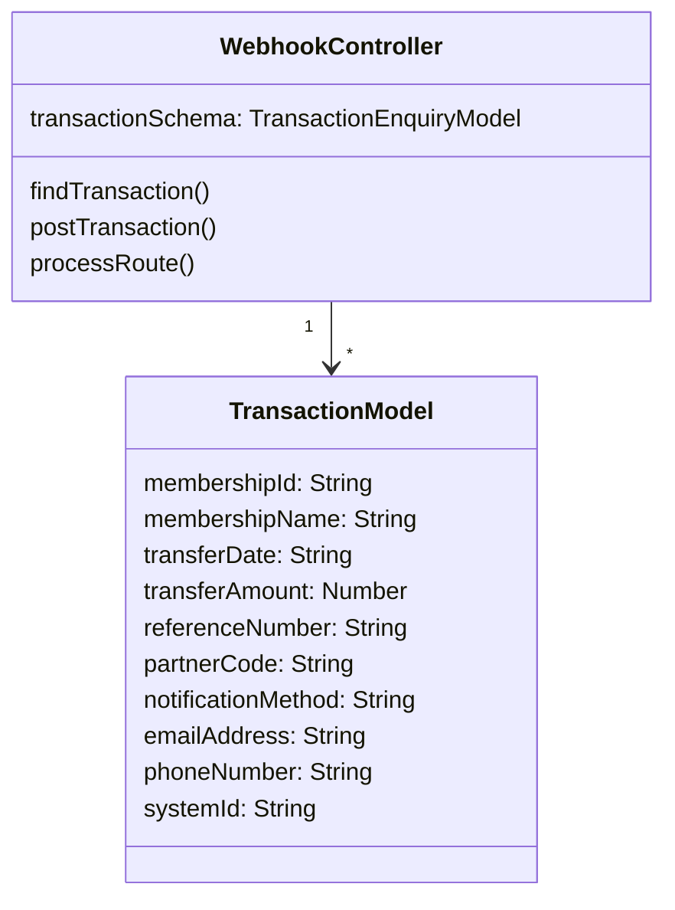
```mermaid
classDiagram
class WebhookController 
WebhookController "1" --> "*" TransactionModel


class WebhookController{
    transactionSchema: TransactionEnquiryModel
    findTransaction()
    postTransaction()
    processRoute()
}

class TransactionModel{
  membershipId: String
  membershipName: String
  transferDate: String
  transferAmount: Number
  referenceNumber: String
  partnerCode: String
  notificationMethod: String
  emailAddress: String
  phoneNumber: String
  systemId: String
}
```

# TransferConnect Class Diagrams

### Notify Transaction Status

Upon transaction status updates after processing of the transaction handback files, retrieves user profile details, their notification details, and directly notifies transaction users their updated transaction status.
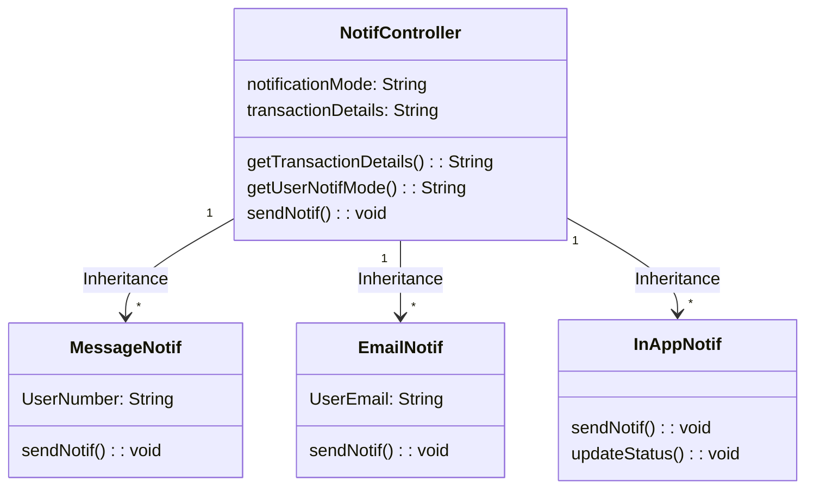
```mermaid
classDiagram
class NotifController 
NotifController "1" --> "*" MessageNotif : Inheritance
NotifController "1" --> "*" EmailNotif : Inheritance
NotifController "1" --> "*" InAppNotif : Inheritance


class NotifController{
    notificationMode: String
    transactionDetails: String
    getTransactionDetails(): String
    getUserNotifMode(): String
    sendNotif(): void
}

class MessageNotif{
    UserNumber: String
    sendNotif(): void
}

class EmailNotif{
    UserEmail: String
    sendNotif(): void
}

class InAppNotif{
    sendNotif(): void
    updateStatus(): void
}


```

# TransferConnect Class Diagrams

### Send Transfer Fulfilment Accrual Files 
This component describes several functions to support the querying of, compilation of and sending of transaction details to the Loyalty Program providers for the day.

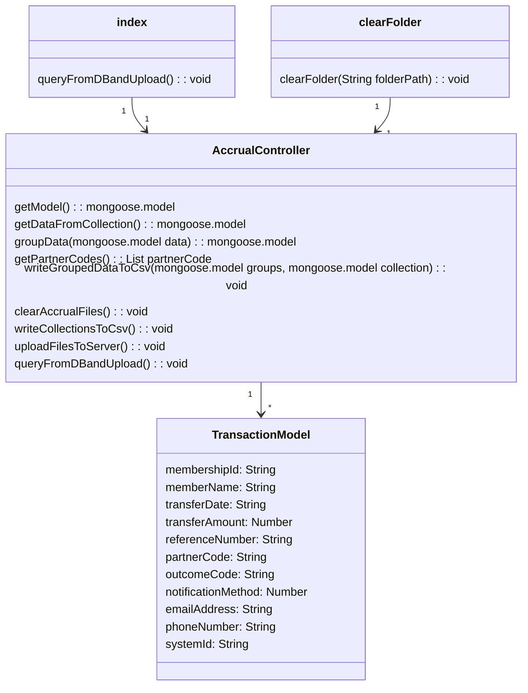
```mermaid
classDiagram
    AccrualController "1" --> "*" TransactionModel
    index "1" --> "1" AccrualController
    clearFolder "1" --> "1" AccrualController

    class index {
    queryFromDBandUpload(): void
    }

    class clearFolder {
        clearFolder(String folderPath): void
    }

    class AccrualController{
        getModel(): mongoose.model
        getDataFromCollection(): mongoose.model
        groupData(mongoose.model data): mongoose.model
        getPartnerCodes(): List partnerCode
        writeGroupedDataToCsv(mongoose.model groups, mongoose.model collection): void
        clearAccrualFiles(): void
        writeCollectionsToCsv(): void
        uploadFilesToServer(): void
        queryFromDBandUpload(): void
    }


  class TransactionModel{
        membershipId: String
        memberName: String
        transferDate: String
        transferAmount: Number
        referenceNumber: String
        partnerCode: String
        outcomeCode: String
        notificationMethod: Number
        emailAddress: String
        phoneNumber: String
        systemId: String
    }
    
```

# TransferConnect Class Diagrams

### Receive Transfer Fulfilment Handback File 
This component describes several functions to support the processing of transaction handback files. The querying of, downloading transaction handback files from Loyalty Program providers when they have processed them and updating transaction details in the TransferConnect database. 

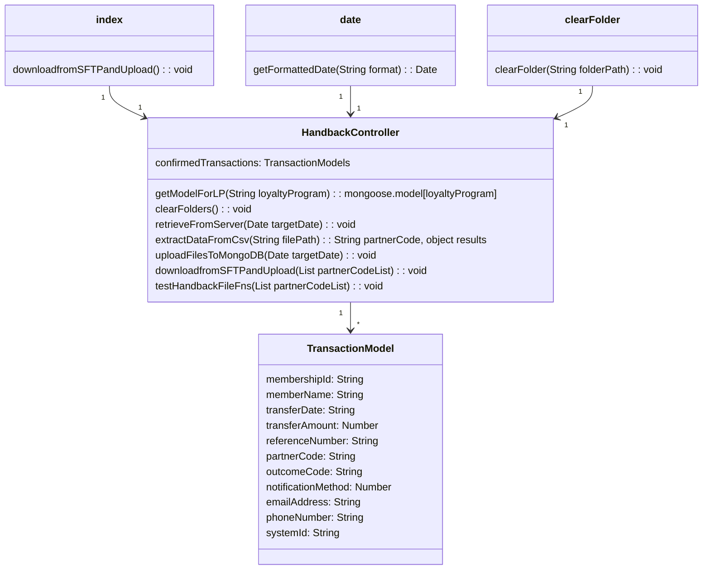
```mermaid
classDiagram
HandbackController "1" --> "*" TransactionModel
index "1"--> "1" HandbackController
date "1" --> "1" HandbackController
clearFolder "1" --> "1" HandbackController

class date {
    getFormattedDate(String format): Date
}

class clearFolder {
    clearFolder(String folderPath): void
}

class index {
    downloadfromSFTPandUpload(): void
}

class HandbackController{
    confirmedTransactions: TransactionModels
    getModelForLP(String loyaltyProgram): mongoose.model[loyaltyProgram]
    clearFolders(): void
    retrieveFromServer(Date targetDate): void
    extractDataFromCsv(String filePath): String partnerCode, object results
    uploadFilesToMongoDB(Date targetDate): void
    downloadfromSFTPandUpload(List partnerCodeList): void
    testHandbackFileFns(List partnerCodeList): void
}

class TransactionModel{
        membershipId: String
        memberName: String
        transferDate: String
        transferAmount: Number
        referenceNumber: String
        partnerCode: String
        outcomeCode: String
        notificationMethod: Number
        emailAddress: String
        phoneNumber: String
        systemId: String
    }

```

# Sequence Diagrams

### Daily interactions between TransferConnect App and Bank App to supply information about Loyalty Programs
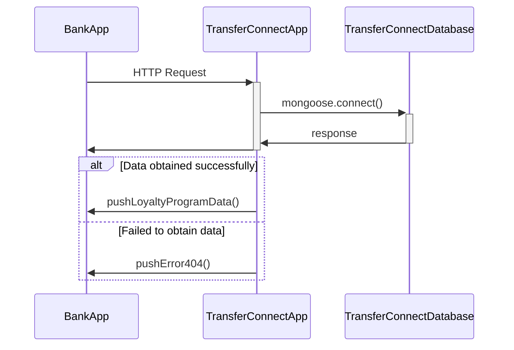
```mermaid
sequenceDiagram

BankApp->>+TransferConnectApp: HTTP Request 

TransferConnectApp->>+TransferConnectDatabase: mongoose.connect()

TransferConnectDatabase->>-TransferConnectApp: response

TransferConnectApp->>-BankApp: 
alt Data obtained successfully
    TransferConnectApp->>BankApp:pushLoyaltyProgramData()
else Failed to obtain data
  TransferConnectApp->>BankApp:pushError404()
end

```

# Sequence Diagrams

### Transaction submission flow between Bank App client, Bank App server, Bank App database, TransferConnect server and TransferConnect database.

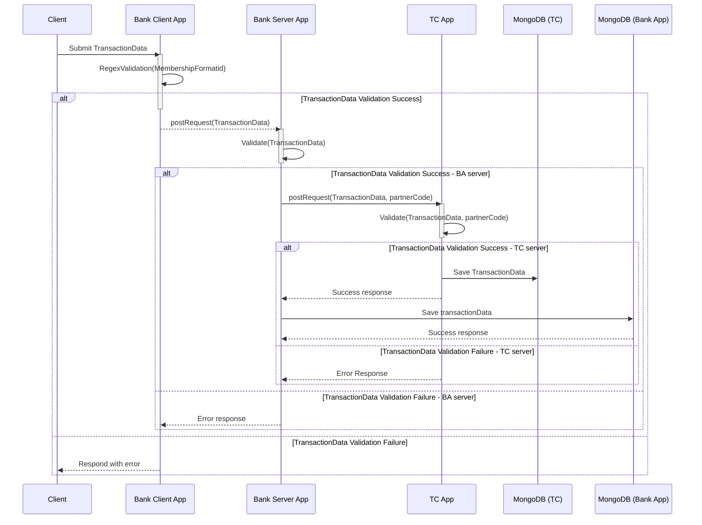
```mermaid
sequenceDiagram

participant Client as Client
participant BankClientApp as Bank Client App
participant BankServerApp as Bank Server App
participant TCApp as TC App
participant MongoDBTC as MongoDB (TC)
participant MongoDBBank as MongoDB (Bank App)

Client->>BankClientApp: Submit TransactionData
activate BankClientApp

BankClientApp ->> BankClientApp: RegexValidation(MembershipFormatid)
alt TransactionData Validation Success
    deactivate BankClientApp

    BankClientApp -->> BankServerApp: postRequest(TransactionData)
    activate BankServerApp

    BankServerApp ->> BankServerApp: Validate(TransactionData)
    deactivate BankServerApp

    alt TransactionData Validation Success - BA server
        BankServerApp ->> TCApp: postRequest(TransactionData, partnerCode)
        activate TCApp
        TCApp ->> TCApp: Validate(TransactionData, partnerCode)
        deactivate TCApp

        alt TransactionData Validation Success - TC server
            TCApp ->> MongoDBTC: Save TransactionData
            TCApp -->> BankServerApp: Success response 
            
            BankServerApp ->> MongoDBBank: Save transactionData
           
            MongoDBBank -->> BankServerApp: Success response
        else TransactionData Validation Failure - TC server
            TCApp -->> BankServerApp: Error Response
        end

       
    else TransactionData Validation Failure - BA server
        BankServerApp -->> BankClientApp: Error response
    end
else TransactionData Validation Failure
    BankClientApp -->> Client: Respond with error
end

```

# Sequence Diagrams

### Transaction status update flows between Bank App, TransferConnect and Loyalty Program partners

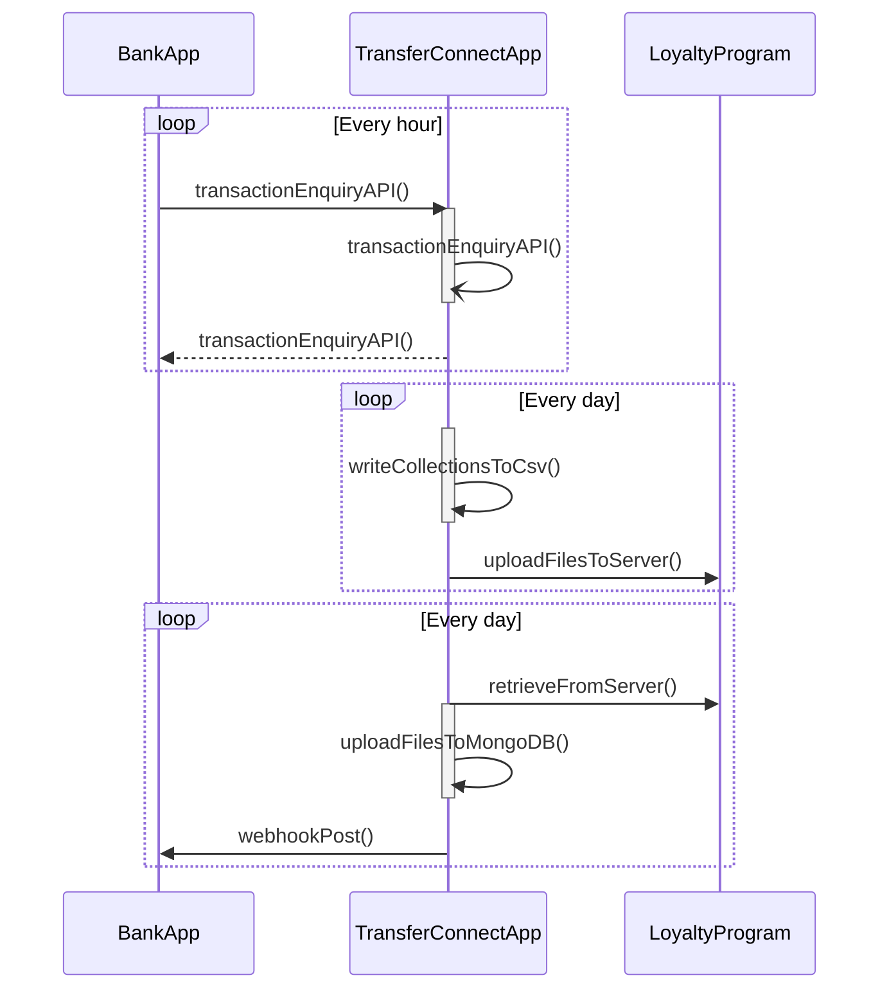
```mermaid
sequenceDiagram

    %% Initialising Actors
    participant BankApp
    participant TransferConnectApp
    participant LoyaltyProgram

    %% Connections

    %% Transaction Enquiry API
    loop Every hour
        BankApp ->> TransferConnectApp: transactionEnquiryAPI()
    activate TransferConnectApp
    TransferConnectApp -) TransferConnectApp: transactionEnquiryAPI()
    deactivate TransferConnectApp
    TransferConnectApp -->> BankApp: transactionEnquiryAPI()
    end
    
    %% TransferFile Sending API
    loop Every day 
        activate TransferConnectApp
        TransferConnectApp ->> TransferConnectApp: writeCollectionsToCsv()
        deactivate TransferConnectApp
        TransferConnectApp ->> LoyaltyProgram: uploadFilesToServer()
    end

    %% TransferFile Retrieving API
    loop Every day
        TransferConnectApp ->> LoyaltyProgram: retrieveFromServer()
        activate TransferConnectApp
        TransferConnectApp ->> TransferConnectApp: uploadFilesToMongoDB()
        deactivate TransferConnectApp
        TransferConnectApp ->> BankApp: webhookPost()
    end
```

# Sequence Diagrams

### Interactions between TransactionEnquiry API provided by TransferConnect App and Notification Controller in Bank App to support notifications to Bank App/Bank App User

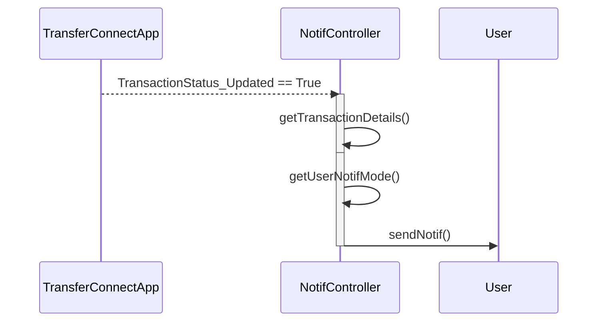
```mermaid
sequenceDiagram
    TransferConnectApp -->> NotifController: TransactionStatus_Updated == True
    activate NotifController
    NotifController ->> NotifController:getTransactionDetails()
    deactivate NotifController
    
    activate NotifController
    NotifController ->> NotifController:getUserNotifMode()
    NotifController ->> User: sendNotif()
    deactivate NotifController

```

# Sequence Diagrams

### Interactions between Bank App and TransferConnect App to support Bank App transaction enquiries

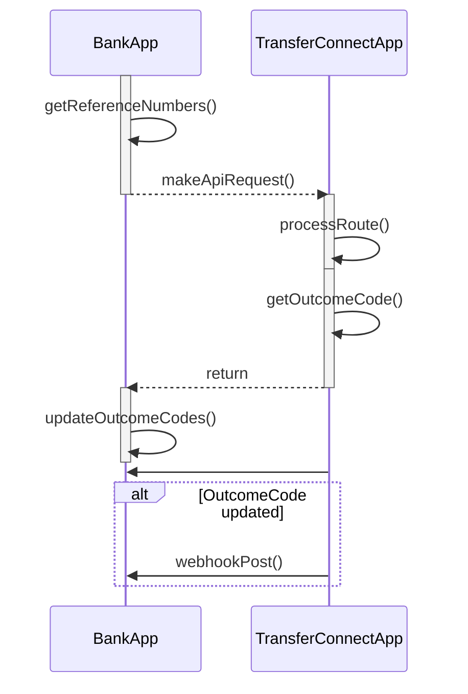
```mermaid

sequenceDiagram
    activate BankApp
    BankApp ->> BankApp: getReferenceNumbers()
    BankApp -->> TransferConnectApp: makeApiRequest()
    deactivate BankApp
    activate TransferConnectApp
    TransferConnectApp ->> TransferConnectApp: processRoute()
    deactivate TransferConnectApp
    activate TransferConnectApp
    TransferConnectApp ->> TransferConnectApp: getOutcomeCode()
    TransferConnectApp -->> BankApp: return
    deactivate TransferConnectApp
    activate BankApp
    BankApp ->> BankApp: updateOutcomeCodes()
    deactivate BankApp

    TransferConnectApp->>BankApp: 
    alt OutcomeCode updated
    TransferConnectApp->>BankApp: webhookPost()
    end
    
```
