# Bank App

### Login 
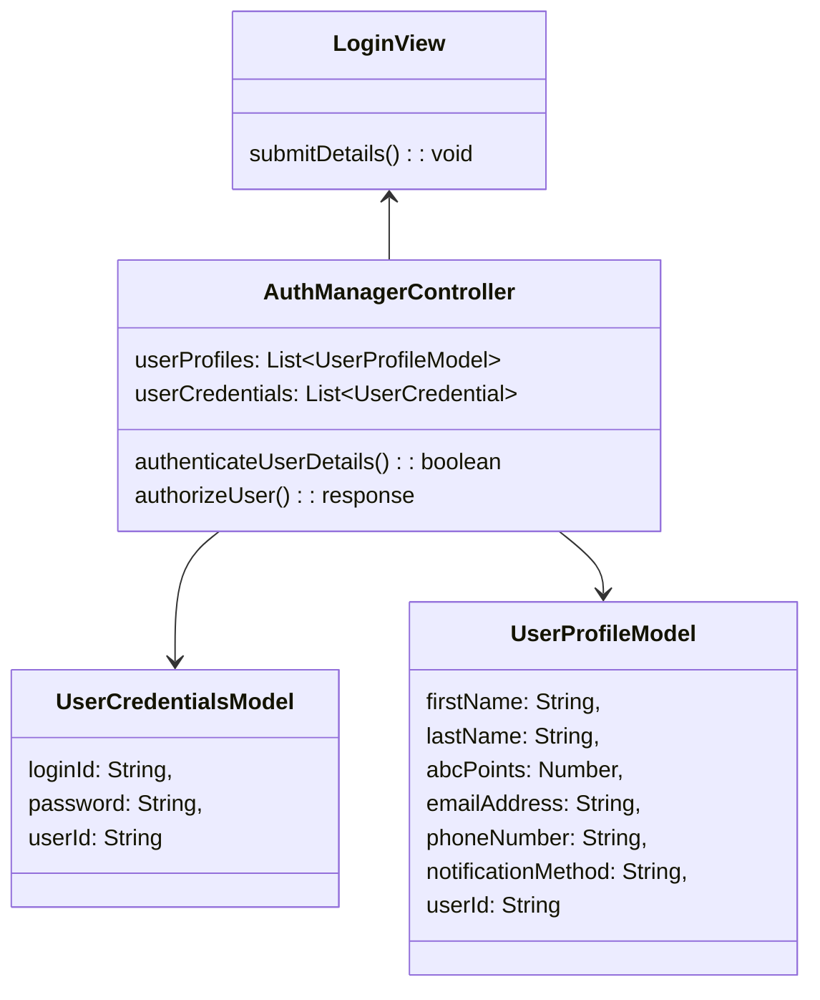
### Query Loyalty Program Details (Loyalty Points Marketplace)

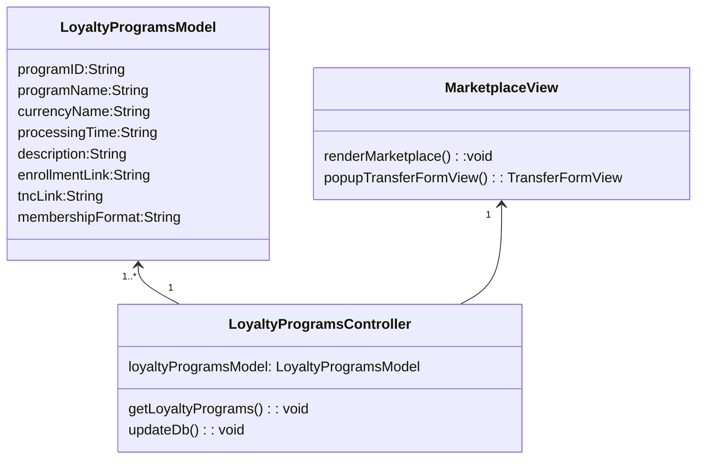

### Submit Credit Transfer Request
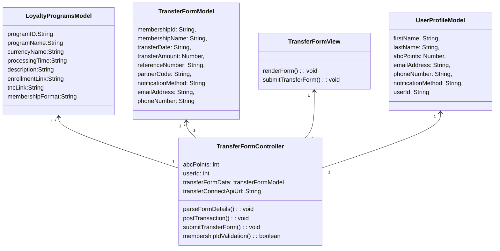

### Enquire Transaction Status

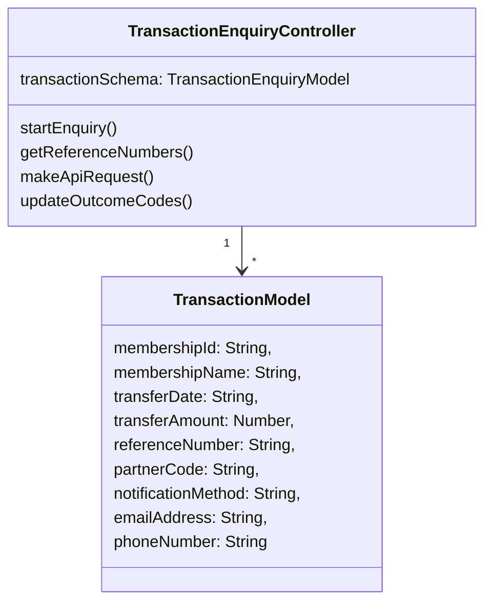

# TransferConnect

### Loyalty Program Query
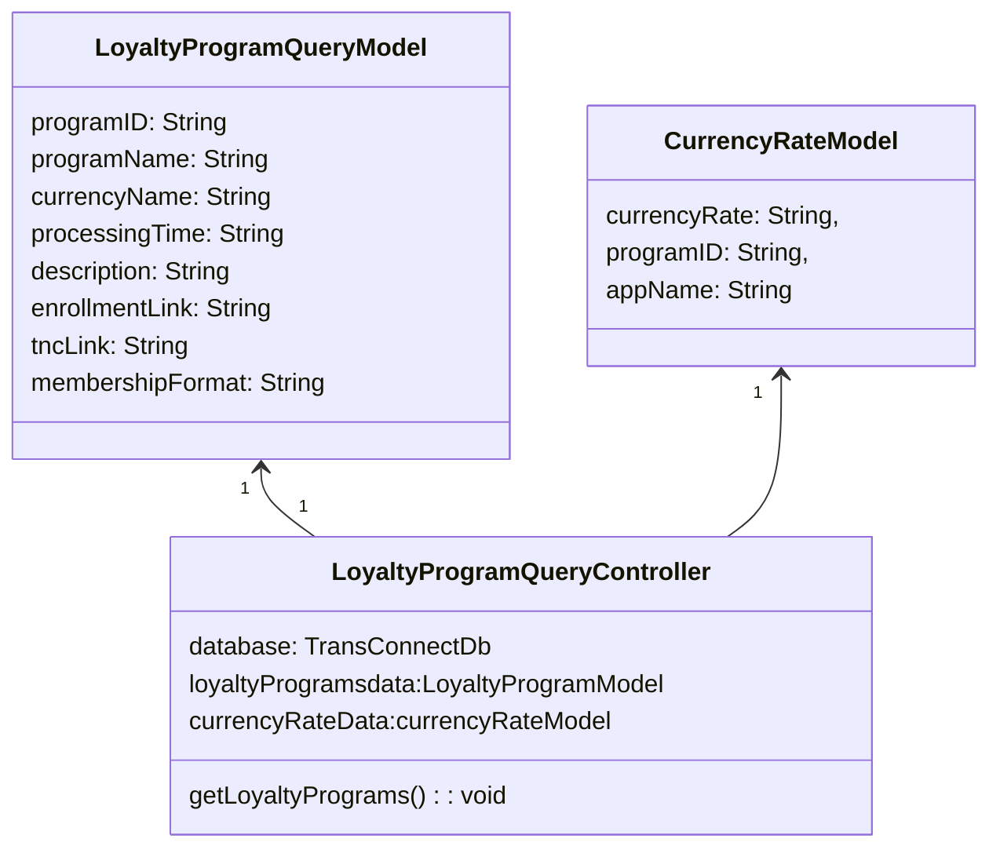
# Transaction Enquiry API

### Enquire Transaction Status

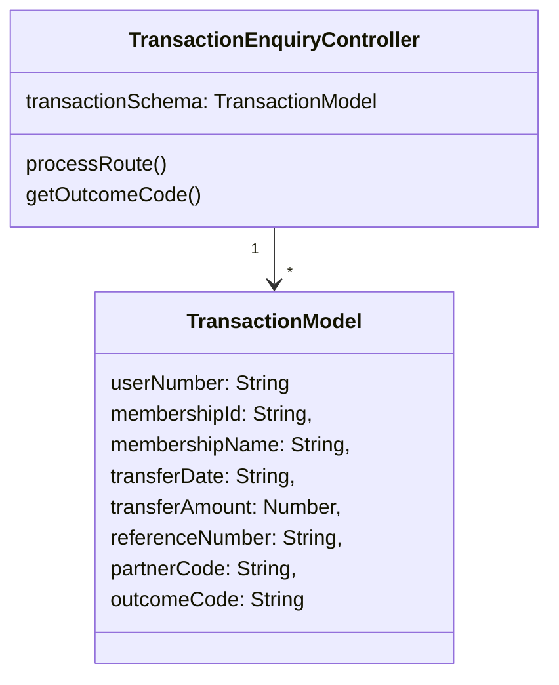

### Notify Transaction Status

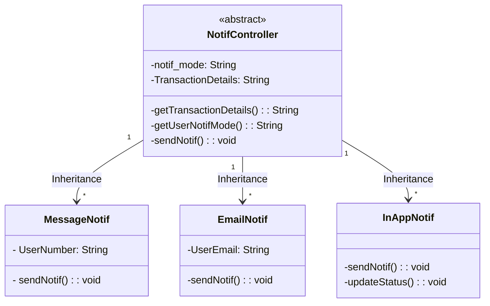
### Send Transfer Fulfilment Accrual Files 

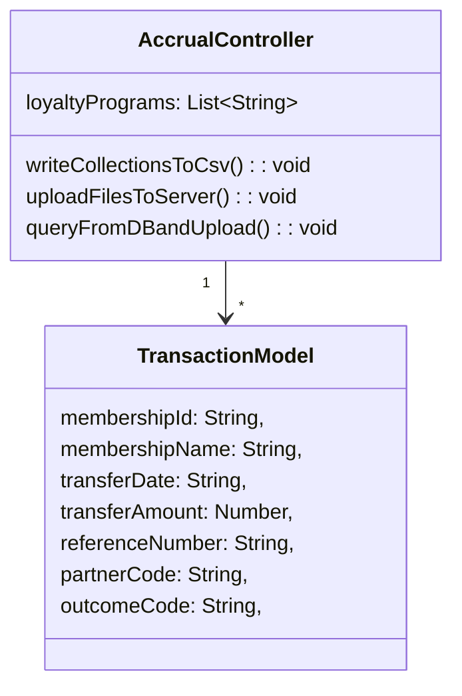
### Receive Transfer Fulfilment Handback File 
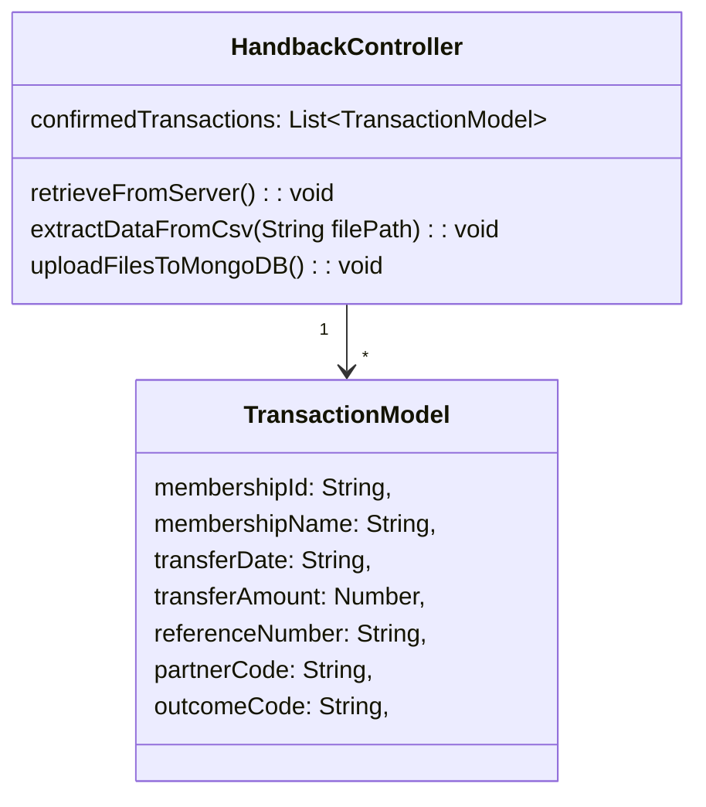

# Sequence Diagrams
### Daily interactions between TransferConnect App and Bank App to supply information about Loyalty Programs

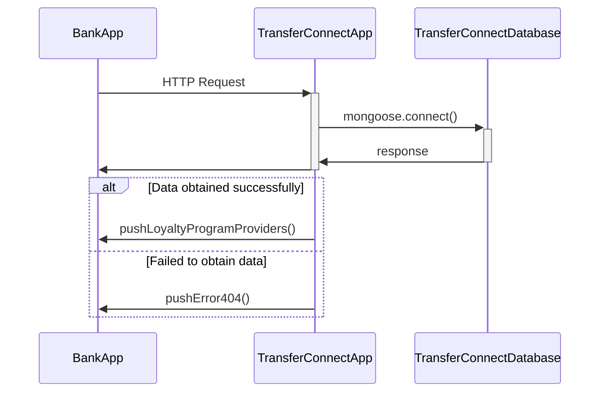
### Daily interactions between TransferConnect App, Bank App and different Loyalty Programs to fulfil transactions
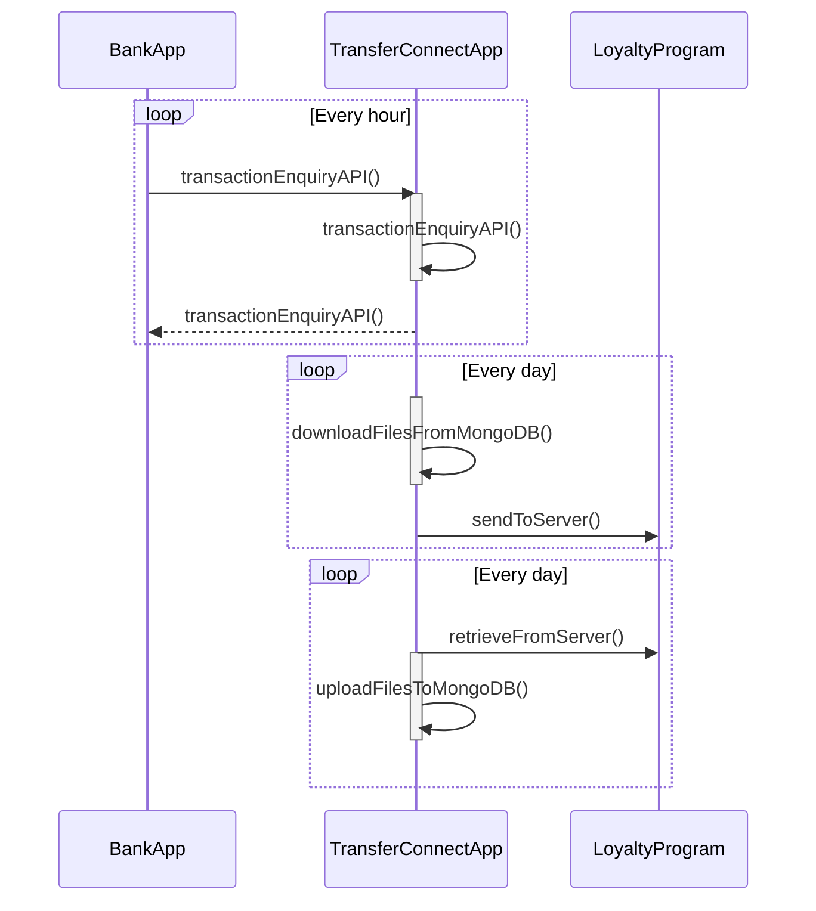

### Interactions between Bank App and TransferConnect App to support Bank App transaction enquiries

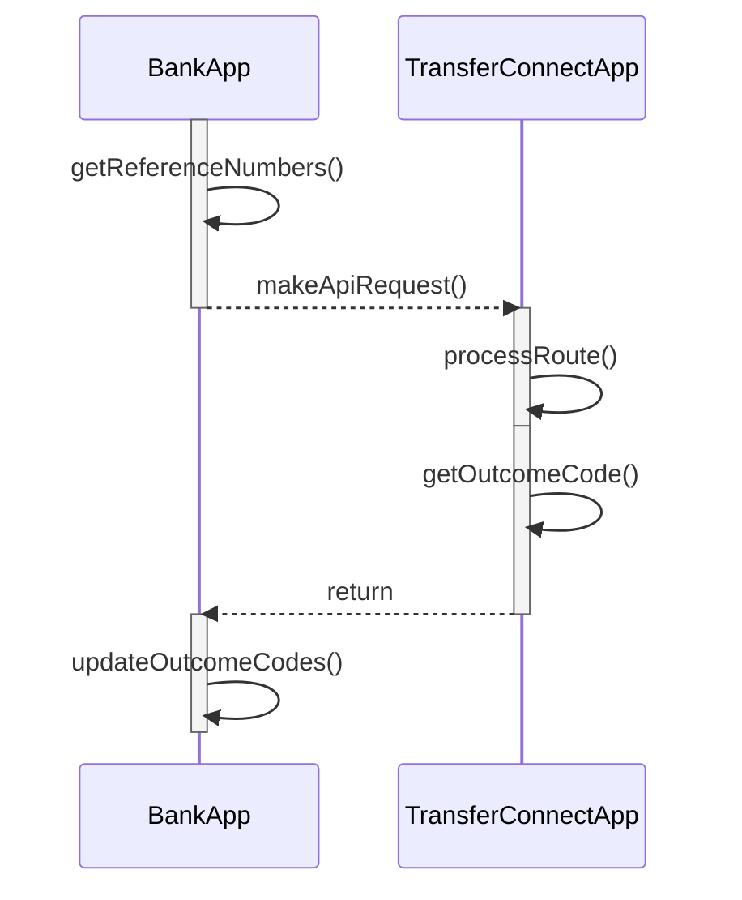

   

### Interactions between TransactionEnquiry API provided by TransferConnect App and Notif Controller in Bank App to support notifications to Bank App/Bank App User

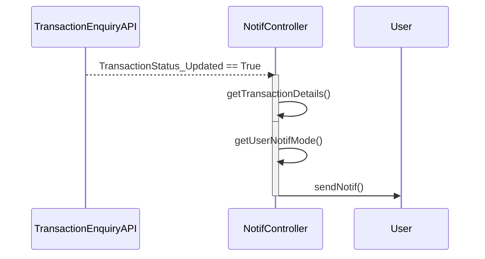