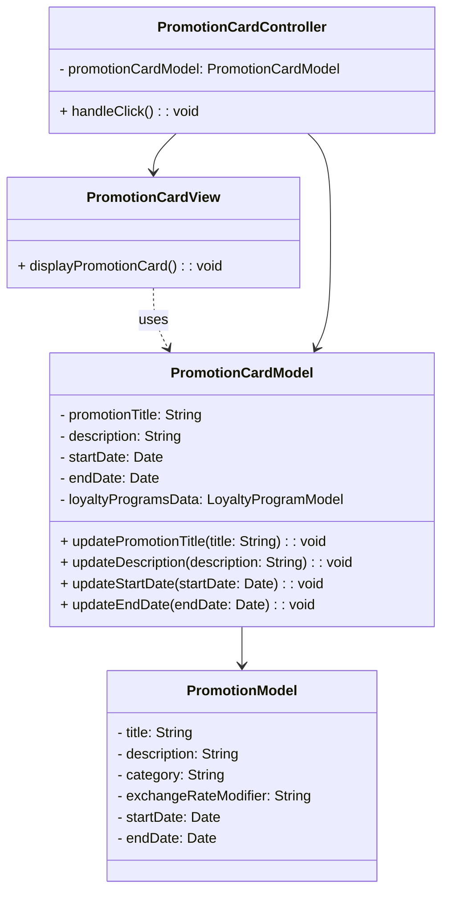

```mermaid
classDiagram
  class PromotionCardModel {
    - promotionTitle: String
    - description: String
    - startDate: Date
    - endDate: Date
    - loyaltyProgramsData: LoyaltyProgramModel
    + updatePromotionTitle(title: String): void
    + updateDescription(description: String): void
    + updateStartDate(startDate: Date): void
    + updateEndDate(endDate: Date): void
  }

  class PromotionModel {
    - title: String
    - description: String
    - category: String
    - exchangeRateModifier: String
    - startDate: Date
    - endDate: Date
  }

  class PromotionCardView {
    + displayPromotionCard(): void
  }

  class PromotionCardController {
    - promotionCardModel: PromotionCardModel
    + handleClick(): void
  }

  PromotionCardModel --> PromotionModel
  PromotionCardView ..> PromotionCardModel: uses
  PromotionCardController --> PromotionCardModel
  PromotionCardController --> PromotionCardView
```