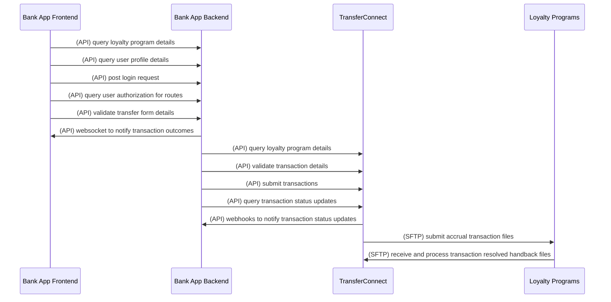

# System Architecture
This diagram describes all the parties and the high-level flows in the Loyalty Points Marketplace.

```mermaid
sequenceDiagram
    Bank App Frontend ->> Bank App Backend: (API) query loyalty program details
    Bank App Frontend ->> Bank App Backend: (API) query user profile details
    Bank App Frontend ->> Bank App Backend: (API) post login request
    Bank App Frontend ->> Bank App Backend: (API) query user authorization for routes
    Bank App Frontend ->> Bank App Backend: (API) validate transfer form details
    Bank App Backend ->> Bank App Frontend: (API) websocket to notify transaction outcomes
    
    Bank App Backend ->> TransferConnect: (API) query loyalty program details
    Bank App Backend ->> TransferConnect: (API) validate transaction details
    Bank App Backend ->> TransferConnect: (API) submit transactions
    Bank App Backend ->> TransferConnect: (API) query transaction status updates
    TransferConnect ->> Bank App Backend: (API) webhooks to notify transaction status updates
    
    TransferConnect ->> Loyalty Programs: (SFTP) submit accrual transaction files
    Loyalty Programs ->> TransferConnect: (SFTP) receive and process transaction resolved handback files
```