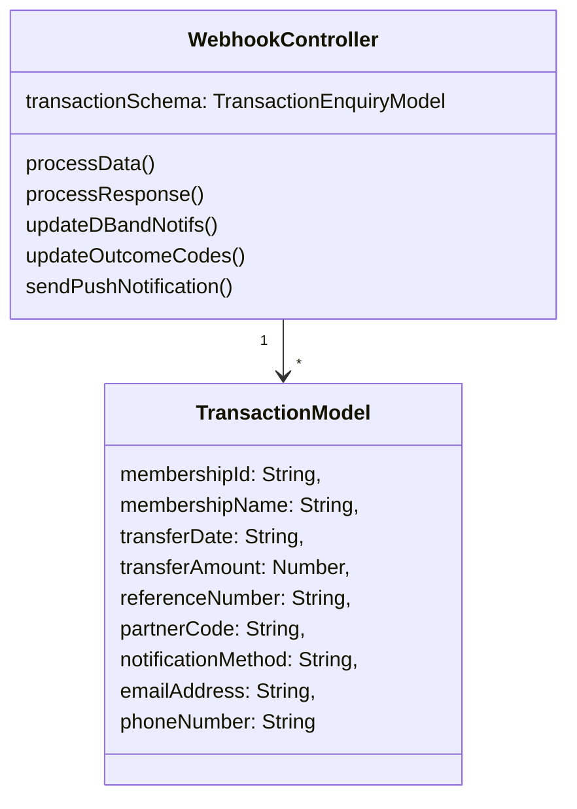
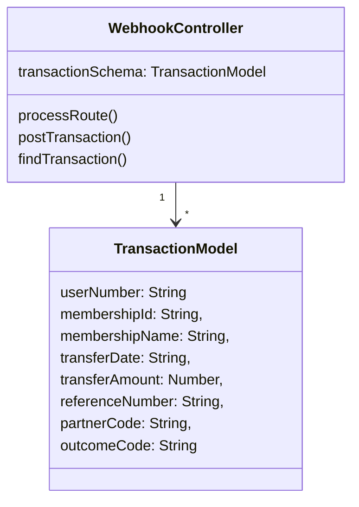

### BankApp

```mermaid
classDiagram
class WebhookController 
WebhookController "1" --> "*" TransactionModel


class WebhookController{
    transactionSchema: TransactionEnquiryModel
    processData()
    processResponse()
    updateDBandNotifs()
    updateOutcomeCodes()
    sendPushNotification()
}

class TransactionModel{
  membershipId: String,
  membershipName: String,
  transferDate: String,
  transferAmount: Number,
  referenceNumber: String,
  partnerCode: String,
  notificationMethod: String,
  emailAddress: String,
  phoneNumber: String
}
```

### Transfer Connect

```mermaid
classDiagram
class WebhookController 
WebhookController "1" --> "*" TransactionModel


class WebhookController{
    transactionSchema: TransactionEnquiryModel
    processData()
    processResponse()
    updateDBandNotifs()
    updateOutcomeCodes()
    sendPushNotification()
}

class TransactionModel{
  membershipId: String,
  membershipName: String,
  transferDate: String,
  transferAmount: Number,
  referenceNumber: String,
  partnerCode: String,
  notificationMethod: String,
  emailAddress: String,
  phoneNumber: String
}
```

```mermaid
classDiagram
class WebhookController
WebhookController "1" --> "*" TransactionModel


class WebhookController{
    transactionSchema: TransactionModel
    processRoute()
    postTransaction()
    findTransaction()
}

class TransactionModel{
    userNumber: String
    membershipId: String,
    membershipName: String,
    transferDate: String,
    transferAmount: Number,
    referenceNumber: String,
    partnerCode: String,
    outcomeCode: String
}


```